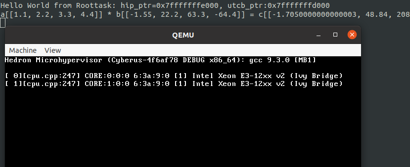

# Minimal Roottask for Hedron in Rust
This repository shows how to build and start a minimal roottask written in Rust on Hedron.

Hedron is an Open Source Microhypervisor developed at Cyberus Technology GmbH.
More Information: <https://github.com/cyberus-technology/hedron>

The roottask is not compatible with [NOVA](https://github.com/udosteinberg/NOVA), because it uses a
Hedron-specific syscall. However, the build process for a NOVA roottask would be similar.

During my time at Cyberus Technology GmbH, I developed a new small runtime environment from
scratch written in Rust for the Hedron Microhypervisor. Since I learned so, so much, and because
I love to share my knowledge, I outsourced the minimal roottask to this project.

I developed this project on a Linux system. It might also build on other UNIX-systems, as long as you are on x86_64.

## Checkout
- checkout this repository
- initialize the submodule (the Hedron Microhypervisor) \
  `$ git submodule update --recursive --init`

## Build
For Hedron, please check out the build advises in the [Hedron README](https://github.com/cyberus-technology/hedron#readme).
For the roottask, you need Cargo and Rust. If you have that, you can execute: \
`$ ./build.sh`

If something fails, for example one package is missing, I'm confident that you are capable of solving this easily.

## Testing in QEMU
You need `QEMU` on your machine installed. If you have that, just type: \
`$ ./run_qemu.sh`

You should see something like the following output: \

On the top you can see some ASCII output on the serial device from the Roottask, followed by some calculations,
that prove that floating-point operations and vector registers can be used. The second window down below shows
the QEMU window with its VGA frame buffer used by Hedron.

## Testing on Real Hardware
Currently, Hedron alone can only boot in legacy boot environments, i.e., non UEFI, thus BIOS, or UEFI with CSM.
You can create a bootable legacy image for x86 with the `./gen_bootimage.sh` script. It will create a bootable image
in `grub/legacy_x86_boot.img` with GRUB as bootloader. You may write this image to an USB drive and boot it.

**Technically, Hedron can boot in UEFI with a custom closed-source UEFI OS-loader at Cyberus Technology GmbH. This is
out of scope.**

The roottask will print information to the serial device (COM1 port) but not to the VGA framebuffer. Thus, you will
only see output from Hedron on the screen so far. Currently, there is no nice mechanism to enable the roottask to
print to a framebuffer.

### What is Bender?
[Bender](https://github.com/blitz/bender) is a Multiboot 1 chainloader intended to be loaded from GRUB or a similar
multiboot-capable bootloader. It tries to find PCI serial controllers and updates the
[BIOS Data Area](https://wiki.osdev.org/BDA#BIOS_Data_Area) to make them discoverable by legacy software.

I use Bender in the `gen_bootimage.sh` script because it enables to get serial output from more real devices.
For example, some don't have an internal COM1 port anymore respectively, do not provide a physical connection to it
anymore. A solution are PCI serial devices.
